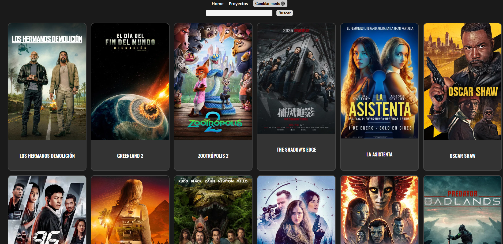
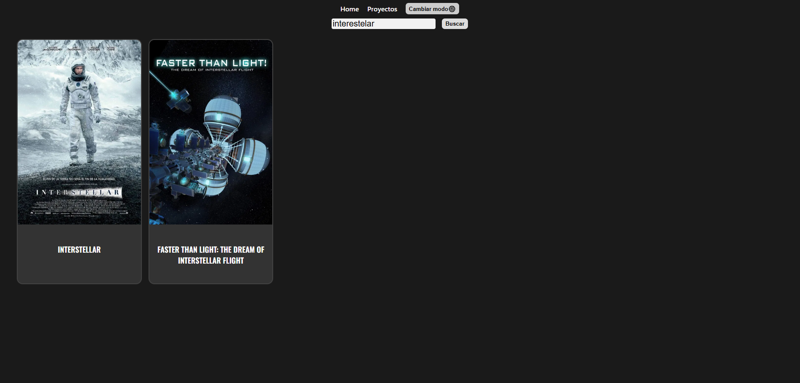
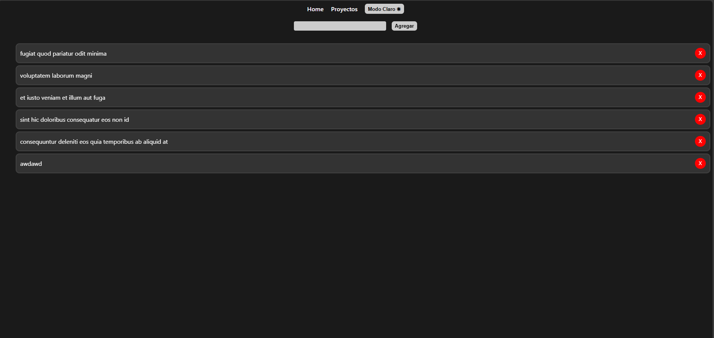

# 🎬 Vanilla Cinema & Task Manager SPA

Este repositorio contiene una Single Page Application (SPA) evolucionada que demuestra el dominio de JavaScript Vanila en dos vertientes: la persistencia de datos local y el consumo de APIs multimedia de alto volumen.

---

## 📂 Estructura del Proyecto

El proyecto se divide en dos módulos lógicos principales:

* **mainMovies.js:** Motor de búsqueda y catálogo de películas conectado a la API de TMDB.

* **mainProjects.js:** Gestor de tareas con persistencia en localStorage (nuestro primer proyecto).

---

## 📽️ Características del Módulo Cinema (TMDB)

Este módulo representa el salto hacia el desarrollo de aplicaciones del mundo real:

* **Consumo de API Real**: Integración con **The Movie Database (TMDB)** mediante `fetch` y **Bearer Tokens**.
* **Buscador Dinámico**: Filtrado de películas con manejo de **Estados Vacíos** (mensajes de "no se encontraron resultados").
* **Paginación Inteligente**: Botón de "Cargar más" que se sincroniza con los metadatos de la API (`total_pages`).
* **Programación Defensiva**: Control de imágenes nulas y gestión de errores de red con `try/catch`.

;

;

---

## 📝 Características del Módulo Project Manager

Mantiene la lógica de nuestro gestor de proyectos original:

* **Persistencia de Datos**: Uso avanzado de JSON.parse y JSON.stringify con localStorage.
* **Reactividad Manual**: Actualización del DOM sin recargas de página mediante funciones de re-renderizado parcial.

;

